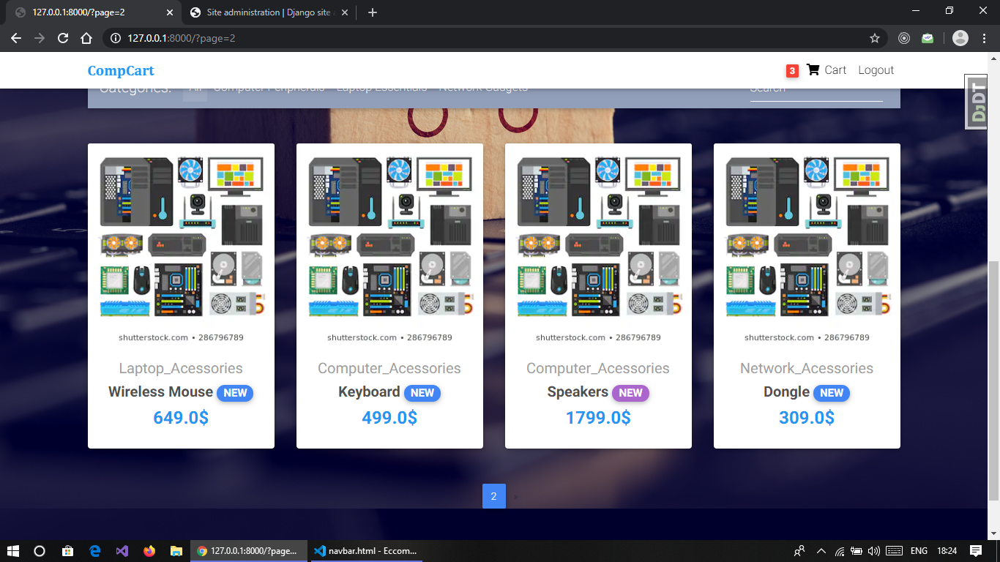
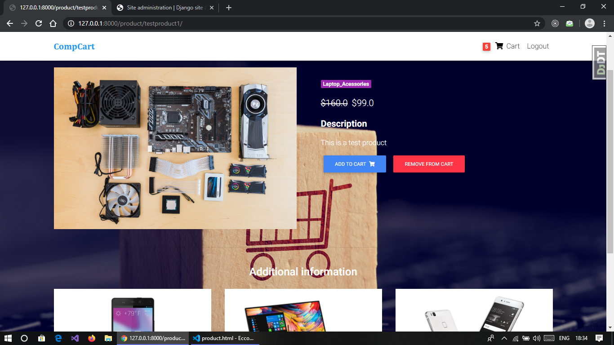
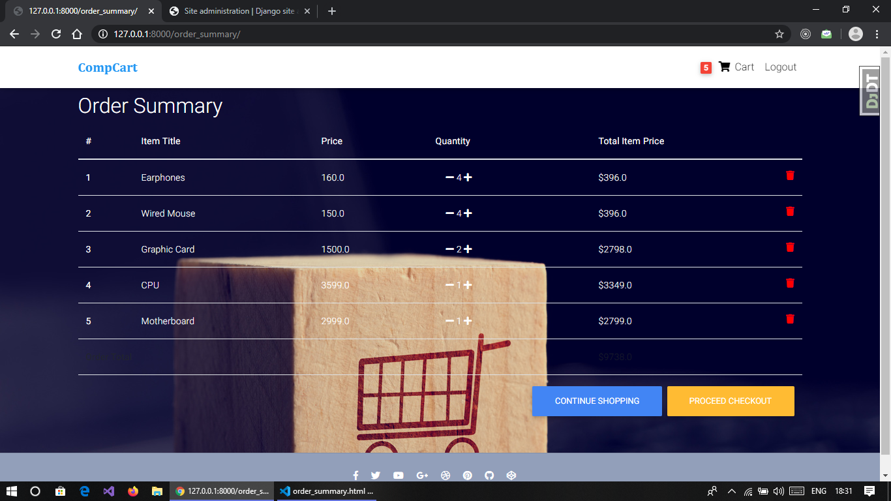
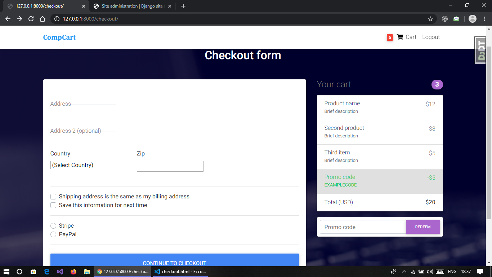
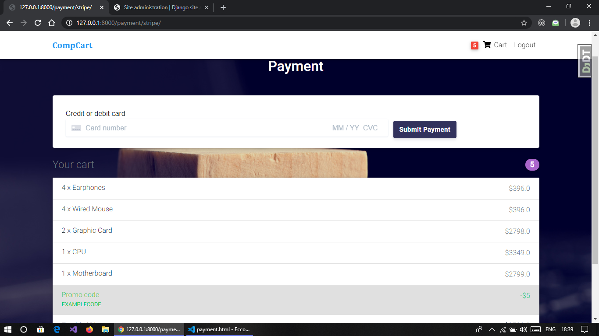

# Comp_Cart
An Ecommerce website in django.

To start running create a vitual environment in the directory then open

the terminal in directory and type these commands :-

pip install -r requirements.txt

python manage.py makemigrations

python manage.py migrate

python manage.py runserver

now you will be able to run website on local host.

Home Page:-

Product Description :-

Order Summary(Cart View):-

Checkout :-

Payment Page (Stripe API):-

